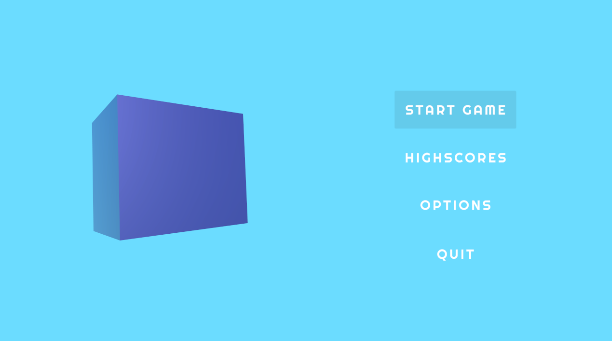
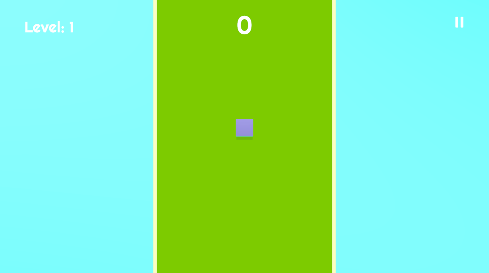
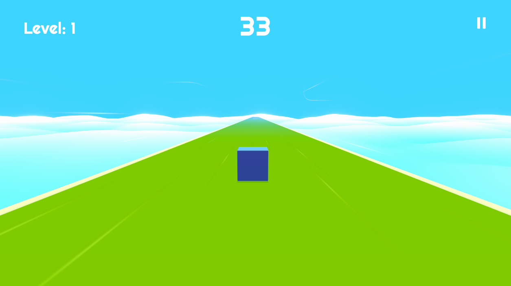
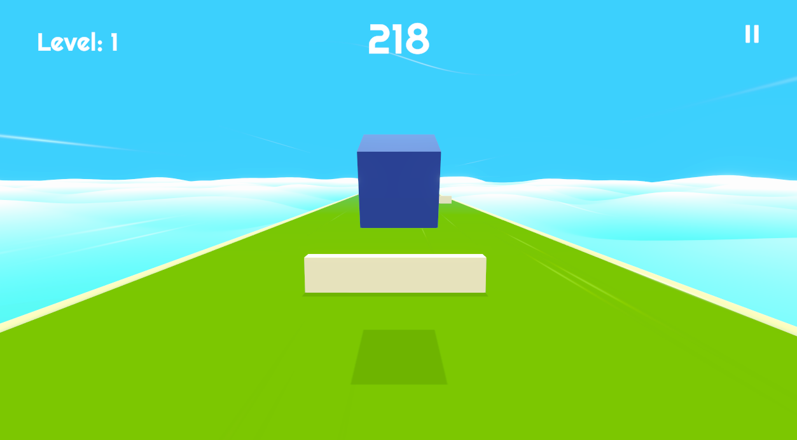
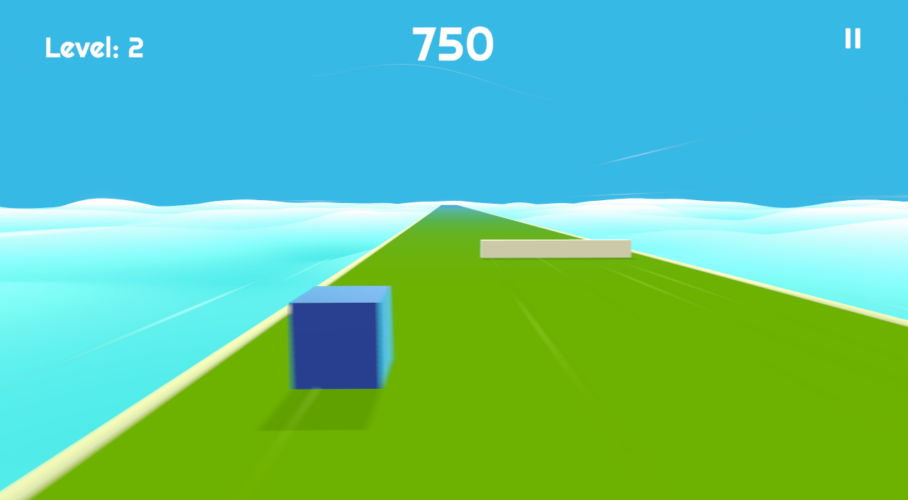
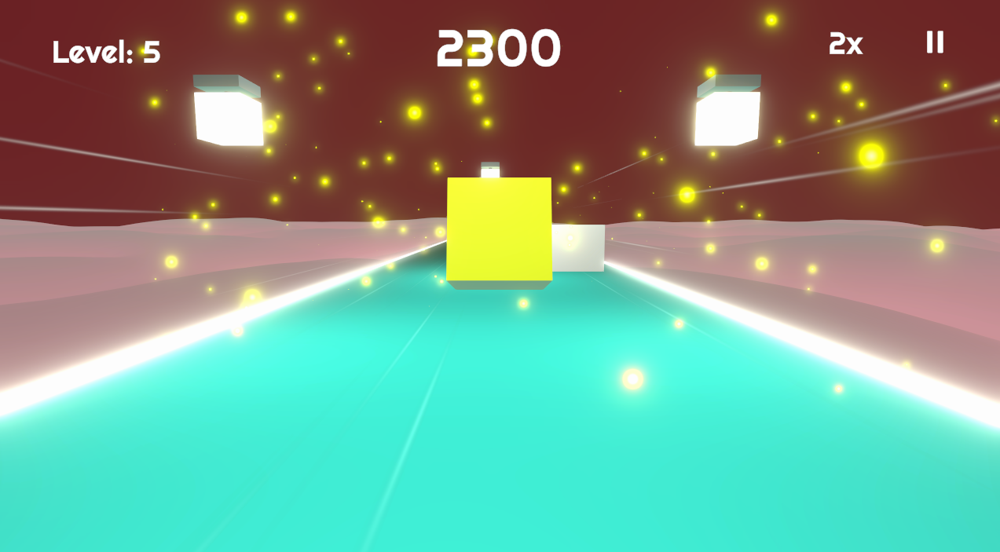

# CubeSurfer
 
## About this game
CubeSurfer is a made with Unity arcade 3D game. Control the Cube and improve your dexterity by avoiding approaching obstacles. Avoid them as long as possible to reach new levels and earn as many point as you can.

## Controls
* **Jump** - <kbd>W</kbd> or <kbd>space</kbd>   
* **Left** - <kbd>A</kbd> or <kbd>⟵</kbd>
* **Right** - <kbd>D</kbd> or <kbd>⟶</kbd>
* **Pause game** - <kbd>P</kbd>

## Gallery

  
   
  
  
  
  

